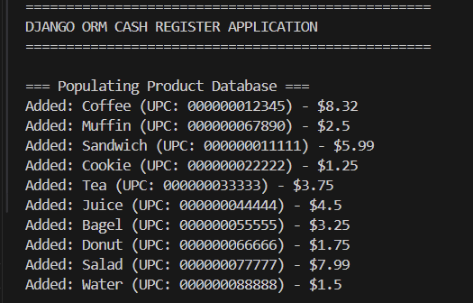
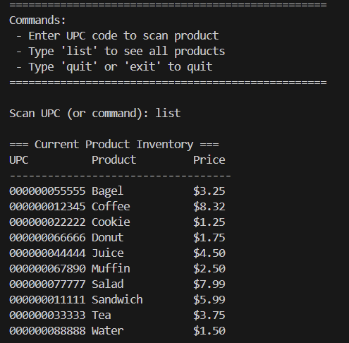
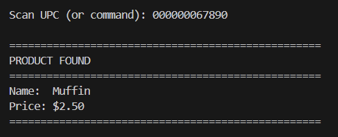
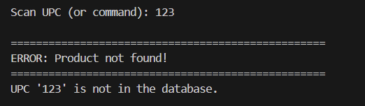

# Assignment 3 - Django ORM Cash Register Application

## Group Members
- **Caren Eissa** - 100920554 (Q2)
- **Shagufta Shaikh** - 100924656 (Q2)  
- **Armaan Parmar** - 100877218 (Q1)

## Project Overview
This project implements a cash register system using Django ORM (Object-Relational Mapping) that allows for product management and scanning functionality. The application demonstrates proper use of Django models, database operations, and interactive user interfaces.

## Code Organization & Django ORM Implementation

### Project Structure
```
assignment-3-django-and-energy-group-20-crn-43510/
│
├── .github/
│ └── .keep 
│
├── db/
│ └── migrations/
│ ├── init.py 
│ └── models.py 
│
├── images/
│ ├── list.png
│ ├── populating_database.png
│ ├── product_found.png
│ └── product_notfound.png
│
├── .gitignore 
├── README.md 
├── main.py 
├── manage.py 
└── settings.py 
```

### Django ORM Usage
The application leverages Django ORM for all database operations:

- **Models**: Defined in `db/models.py` with a `Product` model containing UPC, name, and price fields
- **Database Operations**: Uses Django's ORM for:
  - Creating and populating product records
  - Querying products by UPC
  - Displaying all products
  - Object relationship management

### Key Files Description
- **`main.py`**: Main application script containing the cash register functionality
- **`db/models.py`**: Defines the Product model using Django's Model class
- **`manage.py`**: Django management script for database migrations
- **`settings.py`**: Django project configuration

## 🚀 How to Run

### Prerequisites
- Python 3.x
- Django framework

### Installation & Setup (Windows)

**Clone the repository**
```bash
git clone git@github.com:OTUSOFE365025/assignment-3-django-and-energy-group-20-crn-43510.git
cd assignment-3-django-and-energy-group-20-crn-43510
```
## ⚙️ Create and Activate Virtual Environment

**Command Prompt (Windows):**
```bash
python -m venv venv
venv\Scripts\activate
```

## Install Dependencies

**Command Prompt (Windows):**
```bash
python -m pip install --upgrade pip
python -m pip install django
```

## Initialize Database Schema

**Command Prompt (Windows):**
```bash
python manage.py makemigrations db
python manage.py migrate
```

## Run the Application

**Command Prompt (Windows):**
```bash
python main.py
```

## Application Features & Functionality

- **Database Population:** Automatically populates with sample product data  
- **Product Scanning:** Look up products by UPC code  
- **Inventory Display:** View all products in the database  
- **Interactive Interface:** User-friendly command-line interface  

---

## Commands Available

- Enter a **UPC code** to scan and display product information  
- Type **`list`** to view all products in inventory  
- Type **`quit`** or **`exit`** to close the application  


##  Demonstration

### 📦 Database Records Being Added


---

### 📋 List of All Records


---

### ✅ Valid UPC Scan


---

### ❌ Invalid UPC Scan


## Question 2

### The answers to Question 2 are posted on Canvas.